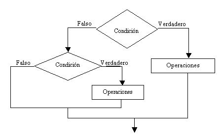

## Estructuras condicionales anidadas

Decimos que una estructura condicional es anidada cuando por la rama del verdadero o el
falso de una estructura condicional hay otra estructura condicional.

El diagrama de flujo que se presenta contiene dos estructuras condicionales. La principal se
trata de una estructura condicional compuesta y la segunda es una estructura condicional
simple y está contenida por la rama del falso de la primer estructura.
Es común que se presenten estructuras condicionales anidadas aún más complejas.

### Problema 1

Confeccionar un programa que pida por teclado tres notas de un alumno, calcule el
promedio e imprima alguno de estos mensajes:

Si el promedio es >=7 mostrar "Promocionado".

Si el promedio es >=4 y <7 mostrar "Regular".

Si el promedio es <4 mostrar "Reprobado".

### problema1.kt

    fun main(args: Array<String>) {
    
        print("Ingrese primer nota:")
        val nota1 = readLine()!!.toInt()
    
        print("Ingrese segunda nota:")
        val nota2 = readLine()!!.toInt()
    
        print("Ingrese tercer nota:")
        val nota3 = readLine()!!.toInt()
    
        val promedio = (nota1 + nota2 + nota3) / 3
    
        if (promedio >= 7)
            print("Promocionado")
        else
            if (promedio >= 4)
                print("Regular")
            else
                print("Libre")
    }

Primero preguntamos si el promedio es superior o igual a 7, en caso afirmativo va por la
rama del verdadero del if mostrando un mensaje que indica "Promocionado" (con comillas
indicamos un texto que debe imprimirse en pantalla).

En caso que la condición nos de falso, por la rama del falso aparece otra estructura
condicional if, porque todavía debemos averiguar si el promedio del alumno es superior o
igual a cuatro o inferior a cuatro.

Estamos en presencia de dos estructuras condicionales compuestas.

En ninguno de los bloques del verdadero y falso de los dos if hemos dispuesto llaves de
apertura y cerrado debido a que hay una sola instrucción en el mismo.

Si utilizamos if como expresiones podemos codificar el mismo programa en forma más
concisa con el siguiente código:

    fun main(args: Array<String>) {
    
        fun main(parametros: Array<String>) {
    
            println("Ingrese primer nota:")
            val nota1 = readLine()!!.toInt()
    
            print("Ingrese segunda nota:")
            val nota2 = readLine()!!.toInt()
    
            print("Ingrese tercer nota:")
            val nota3 = readLine()!!.toInt()
    
            val promedio = (nota1 + nota2 + nota3) / 3
    
            val estado = if (promedio >= 7) "Promocionado" else if (promedio >= 4) "Regular" else "Libre"
    
            print("Estado del alumno $estado")
        }
    
    }

