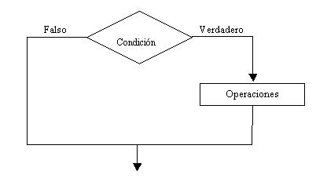
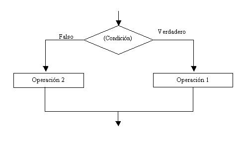

Cuando hay que tomar una decisión aparecen las estructuras condicionales. En nuestra
vida diaria se nos presentan situaciones donde debemos decidir.

¿Elijo la carrera A o la carrera B?

¿Me pongo este pantalón?

Para ir al trabajo, ¿elijo el camino A o el camino B?

Al cursar una carrera, ¿elijo el turno mañana, tarde o noche?

## Estructura condicional simple

Cuando se presenta la elección tenemos la opción de realizar una actividad o no realizar
ninguna.

Representación gráfica:

**Podemos observar:** El rombo representa la condición. Hay dos opciones que se pueden
tomar. Si la condición da verdadera se sigue el camino del verdadero, o sea el de la
derecha, si la condición da falsa se sigue el camino de la izquierda.

Se trata de una estructura **CONDICIONAL SIMPLE** porque por el camino del verdadero hay
actividades y por el camino del falso no hay actividades.

Por el camino del verdadero pueden existir varias operaciones, entradas y salidas, inclusive
ya veremos que puede haber otras estructuras condicionales.

## Problema 1

 Ingresar el sueldo de una persona, si supera los 3000 pesos mostrar un mensaje en pantalla
indicando que debe abonar impuestos.

<pre>

    fun main(args: Array<String>) {

        println("Por Favor ingresar su sueldo")
        val sueldo = readLine()!!.toInt()
    
        if (sueldo > 3000) {
            println("Debe abaonar sus impuestos")
        } else {
            println("Felicidades esta libre de impuestos")
        }

    }

</pre>

    La palabra clave "if" indica que estamos en presencia de una estructura condicional;
seguidamente disponemos la condición entre paréntesis. Por último encerrada entre llaves
las instrucciones de la rama del verdadero.

Es necesario que las instrucciones a ejecutar en caso que la condición sea verdadera estén
encerradas entre llaves { }, con ellas marcamos el comienzo y el fin del bloque del
verdadero.

Pero hay situaciones donde si tenemos una sola instrucción por la rama del verdadero
podemos obviar las llaves y hacer nuestro código más conciso:

<pre>
    if (sueldo > 3000)
    println("Debe pagar impuestos")
</pre>

En los problemas de aquí en adelante no dispondremos las llaves si tenemos una sola
instrucción.

Ejecutando el programa e ingresamos un sueldo superior a 3000 pesos. Podemos observar
como aparece en pantalla el mensaje "Debe pagar impuestos", ya que la condición del if es
verdadera.

Volvamos a ejecutar el programa y carguemos un sueldo menor o igual a 3000 pesos. No
debe aparecer mensaje en pantalla.

## Estructura condicional compuesta
Cuando se presenta la elección tenemos la opción de realizar una actividad u otra. Es decir
tenemos actividades por el verdadero y por el falso de la condición. Lo más importante que
hay que tener en cuenta que se realizan las actividades de la rama del verdadero o las del
falso, NUNCA se realizan las actividades de las dos ramas.

Representación gráfica:

En una estructura condicional compuesta tenemos entradas, salidas, operaciones, tanto por
la rama del verdadero como por la rama del falso.
